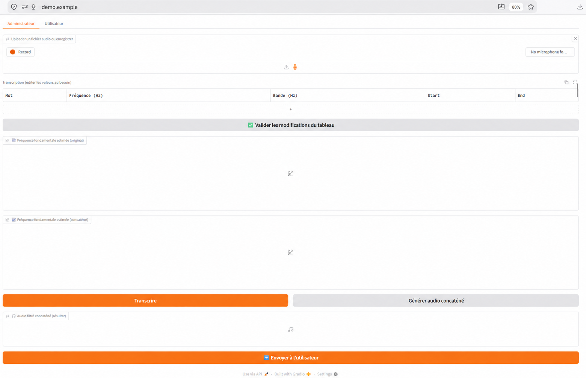
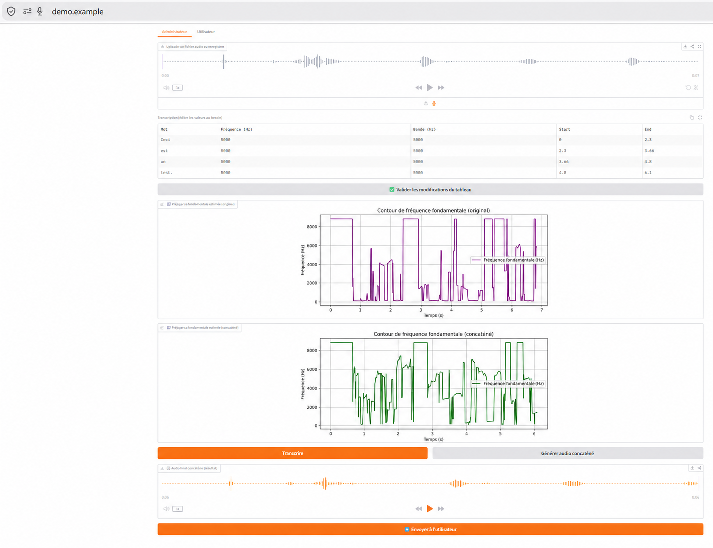
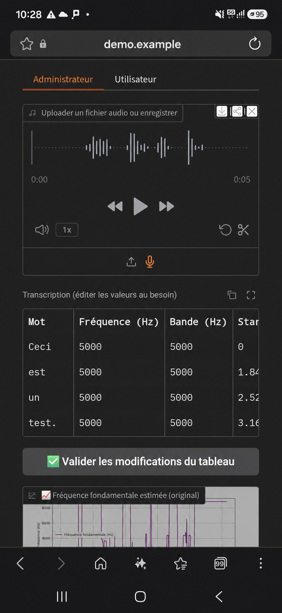
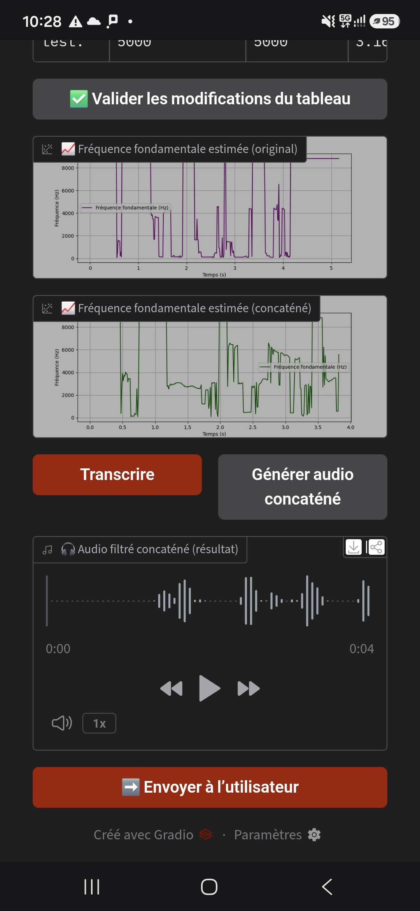
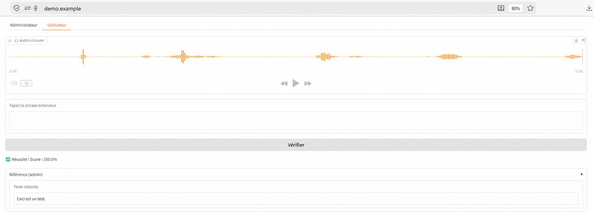
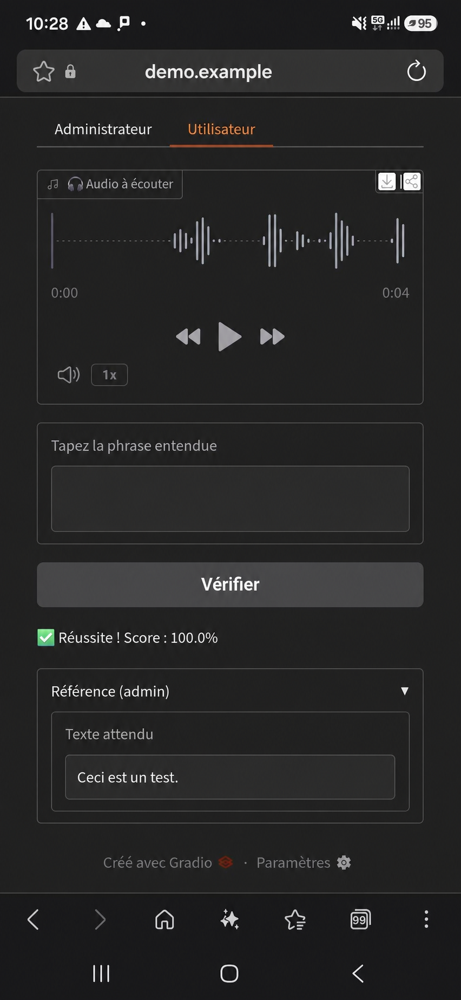

# Build an Interactive Audio Perception MVP with Gradio and OCI Data Science

## From a recorded sentence to word-level audio transformation and user feedback

This tutorial originated from a real-world MVP discussion: a prospective customer wanted to explore whether a simple, interactive audio workflow could be built quickly around word-level frequency transformation and listening feedback.

The objective was not to create a production application or validate a scientific protocol. It was to make an idea testable: record or upload a spoken sentence, split it into words, associate each word with adjustable frequency settings, generate a transformed sequence, and ask a listener to enter what they heard.

The result is a transparent Gradio prototype that makes each step visible and editable, and combines Whisper, Librosa, and SciPy within an OCI Data Science Notebook Session; OCI Data Science provides the managed notebook environment in which the workflow can be assembled, tested, stopped, and extended without first building and operating application infrastructure.

OCI Data Science provides the managed JupyterLab workspace, selectable Compute, persistent storage, and simple start/stop lifecycle for the experiment. The scope is deliberately limited to a demonstrator. As stated above, it is not a validated scientific protocol, clinical tool, hearing assessment, or production application.



*Figure 1 — What you will build: the Gradio Administrator interface brings together recording or upload, word-level settings, frequency plots, audio generation, and handoff to the end-user workflow in one responsive page.*

## What you will build

- Microphone recording or audio-file upload.
- French transcription with Whisper word timestamps.

> **Language note —** This MVP is configured for French transcription. To use English, change `language="fr"` to `language="en"` in `transcribe_file`. To let Whisper detect the spoken language automatically, remove the `language` parameter.

- An editable word-level table for target frequency, bandwidth, and timing.
- Pitch shifting and Butterworth band-pass filtering for each word.
- Concatenated output audio, frequency plots, and an end-user transcription check.

Companion code: `notebooks/word-level-audio-perception-gradio-oci.ipynb` in the [repository](https://github.com/Alexis-BL/oci-data-science-gradio-audio-mvp).

## Prerequisites

You need an OCI account, permissions to create Data Science resources, a Notebook Session with outbound internet access, and the tutorial notebook. A small CPU shape can run the MVP. Run the notebook only with audio that you are permitted to process.

## Step 1 — Create the OCI workspace

1. In the OCI Console, open **Analytics & AI** → **Data Science** → **Projects**.
2. Create or select a project.
3. Create a Notebook Session with an appropriate VM shape, Block Storage, and outbound-capable network configuration. The Block Storage already attached to the Notebook Session is sufficient for this tutorial.
4. Activate the session and open JupyterLab.

The attached Block Storage preserves the notebook and working files after a session is deactivated and later reactivated. In a standard Notebook Session, it is mounted at `/home/datascience` and is available from the JupyterLab file tree.

## Step 2 — Upload and prepare the notebook

Upload `notebooks/word-level-audio-perception-gradio-oci.ipynb`, open it in JupyterLab, select a Python kernel, and run cells in their notebook order. Do not skip the installation cells.

## Step 3 — Install the dependencies and FFmpeg

Run the notebook installation cells:

```python
!pip install gradio
!pip install openai-whisper
!pip install gtts librosa soundfile
!pip install faster-whisper
!pip install ffmpeg-python
```

The notebook then downloads and installs FFmpeg, followed by:

```python
!ffmpeg -version
```

> **FFmpeg environment note —** FFmpeg installation can vary depending on the OCI Data Science image, Conda environment, operating-system architecture, and available shared libraries. This MVP retains the static installation method that worked in the environment in which it was originally developed and tested. Treat it as a tested reference rather than a universal installation procedure. Before continuing, verify that `ffmpeg -version` runs successfully. If it does not, install a build compatible with your selected Notebook Session environment and architecture. Troubleshooting every possible FFmpeg configuration is outside the scope of this MVP tutorial.

Whisper's `small` model is loaded when the application cell runs. First use can download model files and may take time depending on the selected shape and network.

## Step 4 — Transcribe a sentence

In the **Administrator** tab, record a French sentence or upload audio, then select **Transcribe**. The notebook invokes:

```python
res = _WHISPER_MODEL.transcribe(
    audio_path,
    language="fr",
    word_timestamps=True,
    fp16=False
)
```

The editable table contains the transcribed word, default target frequency of `1000 Hz`, default bandwidth of `500 Hz`, and the start/end timestamp. It also plots an estimated fundamental-frequency contour for the original audio.

## Step 5 — Adjust and validate word-level settings

Edit the target frequency, filter bandwidth, or timestamps when appropriate, then select **Validate table changes**. These settings are experimental controls. The default target frequency is only a starting value for exploration; it is not an automatically measured acoustic property of the word.



*Figure 2 — Desktop view of the Administrator tab after word-level frequency and bandwidth settings have been entered. The interface displays the editable transcription table, the original and concatenated fundamental-frequency contours, and the generated audio player.*



*Figure 3 — Mobile view of the responsive Administrator tab after recording a sentence. The recording player, editable word-level frequency and bandwidth table, validation action, and original fundamental-frequency contour remain available on a phone-sized display.*

## Step 6 — Generate the audio sequence

Select **Generate concatenated audio**. For each word, the notebook extracts the segment, estimates fundamental frequency using `librosa.yin`, shifts its pitch toward the selected target using `librosa.effects.pitch_shift`, and applies a fourth-order Butterworth band-pass filter. The core sequence is:

```python
seg = y[i0:i1].astype(np.float32)
seg_shift = _shift_to_freq(seg, sr, target_freq_hz=f0)
seg_colored = _bandpass_filter(seg_shift, sr, fc_hz=f0, bw_hz=bw)
out.append(seg_colored)
```

The processed segments are concatenated with `np.concatenate(out)`. The application displays the result and its estimated fundamental-frequency contour.



*Figure 4 — Mobile view after generating the concatenated audio. The interface shows the original and processed fundamental-frequency contours, the generated-audio player, and the action used to send the resulting sequence to the end user.*

## Step 7 — Send the test to an end user

Select **Send to user** and open the **End User** tab. The user listens to the generated audio, enters the phrase heard, and selects **Verify**. The MVP normalizes text and compares words with the administrator reference. This is a simple experimental check, not a sequence-aware accuracy metric or a scientific validation instrument.



*Figure 5 — Desktop view of the End User tab. The user listens to the generated audio, enters the perceived sentence, runs the verification, and sees the resulting score alongside the administrator reference.*



*Figure 6 — Mobile view of the same End User workflow, showing the audio player, response field, verification action, score, and reference panel on a phone-sized display.*

## Step 8 — Share responsibly

The notebook calls:

```python
demo.launch(share=True)
```

This produces a convenient temporary Gradio demonstration link. Do not use it with confidential, personal, regulated, proprietary, or sensitive audio. It is not an OCI production endpoint and does not replace an application architecture with identity, authorization, secure hosting, monitoring, and data governance.

## From MVP to an OCI architecture

Gradio is particularly effective at the MVP stage: it turns Python functions into an interactive web interface with minimal frontend code. In this tutorial, it provides the administrator and end-user views, audio controls, editable parameters, charts, and feedback form in a single application. This dramatically shortens the path from an audio-processing idea to a testable web experience.

OCI Data Science provides the managed environment in which that Gradio application, the notebook, Python dependencies, and audio-processing workflow can be developed and tested together. A Notebook Session can be activated when experimentation is needed and deactivated afterwards, while notebooks and working files remain available on attached Block Storage.

For an operational architecture, separate the web interface, audio storage, repeatable processing, and model-serving responsibilities. OCI Data Science Jobs can run repeatable tasks outside the notebook; Object Storage can retain inputs and outputs under controlled policies; and OCI Data Science Model Deployments can expose managed HTTP endpoints for suitable model-serving workloads.

The temporary Gradio sharing URL is designed for rapid demonstration and feedback. Gradio itself can also be deployed as part of a production architecture, taking into account that production use requires an appropriate hosting, identity, security, monitoring, scalability, and data-governance design.

## Further resources

- [OCI Data Science overview](https://docs.oracle.com/en-us/iaas/data-science/using/overview.htm)
- [Notebook Sessions](https://docs.oracle.com/iaas/Content/data-science/using/use-notebook-sessions.htm)
- [OCI Data Science Jobs](https://docs.oracle.com/en-us/iaas/Content/GSG/Reference/getting-started-as-data-scientist.htm)
- [OCI Data Science Model Deployments](https://docs.oracle.com/en-us/iaas/Content/data-science/using/ai-quick-actions-model-deploy.htm)
- [Gradio Quickstart guides](https://gradio.app/guides/quickstart)
- [Companion repository disclaimer](https://github.com/Alexis-BL/oci-data-science-gradio-audio-mvp/blob/main/DISCLAIMER.md)

**License scope —** The MIT License in the companion repository applies only to the code and original documentation distributed in that repository. OCI Data Science and other third-party services, software, documentation, and trademarks remain subject to their respective terms and licenses.

**AI assistance —** AI tools were used to support the preparation and review of this material. All final content was reviewed and edited by the author.

## Disclaimer

This article and its companion repository are a personal technical reference implementation and starter MVP, provided for education, experimentation, and evaluation only. They are not a production-ready product, managed service, security or compliance solution, legal, medical, scientific, financial, or professional advice, or a commitment to provide any service. This MVP is not a validated scientific protocol, clinical tool, hearing assessment, speech-recognition guarantee, or safety-critical system. Its audio transformation and text-verification results may be incomplete, inaccurate, version-dependent, or unsuitable for a particular use; independent validation and human review are required before consequential use.

The views, technical perspectives, and recommendations are personal. They do not represent the views, policies, positions, recommendations, or commitments of the author's employer, Oracle, Oracle Cloud Infrastructure, or any affiliated entity. This is not an official Oracle publication, product, reference architecture, support statement, certification, or endorsement.

All material is provided **AS IS** and **AS AVAILABLE**, without warranty or condition of any kind, express or implied, to the fullest extent permitted by law. No guarantee is made as to correctness, availability, performance, security, reliability, transcription quality, word timestamps, pitch estimation, audio intelligibility, reproducibility, scientific validity, cost, fitness for purpose, non-infringement, or suitability. No support, SLA, maintenance, incident response, security remediation, training, troubleshooting, compatibility, or production commitment is provided. Users are solely responsible for review, testing, adaptation, operation, security, monitoring, backup, and compliance.

Audio recordings and transcriptions can contain personal, biometric, sensitive, confidential, proprietary, or third-party content. Do not process, upload, share, or publish them without the necessary rights, notices, permissions, and legal basis. The notebook can download packages and models and can expose a temporary Gradio sharing link. Do not use that link with confidential, personal, regulated, proprietary, or sensitive audio. Users must independently assess provider terms, data residency, retention, consent, copyright, contractual terms, encryption, IAM, network access, and regulatory obligations before sending data to OCI, model providers, or other third-party services. Never commit credentials, private keys, tokens, PAR URLs, confidential recordings, personal data, or proprietary outputs to source control, screenshots, issues, logs, or prompts.

OCI Compute, Block Storage, Object Storage, network traffic, and third-party services may incur charges. Always Free eligibility, capacity, quotas, service limits, pricing, regions, APIs, package behavior, and model availability may change. The MIT License applies only to material authored in the companion repository; it grants no right to third-party services, audio, documentation, or marks. Oracle, OCI, Gradio, OpenAI, Whisper, Hugging Face, Librosa, SciPy, FFmpeg, Jupyter, Python, and all other names and marks belong to their respective owners; use is descriptive only and does not imply affiliation, sponsorship, certification, or endorsement.

To the fullest extent permitted by law, the author and copyright holders are not liable for direct, indirect, incidental, special, consequential, exemplary, or other loss or damage, including loss of data, audio, revenue, business, reputation, availability, security, or anticipated savings, arising from or related to this article, the repository, their use, inability to use them, or any configured service or provider. Nothing excludes liability that cannot lawfully be excluded or limited. By using the material, you accept responsibility for your own review, decisions, deployment, and compliance obligations.
